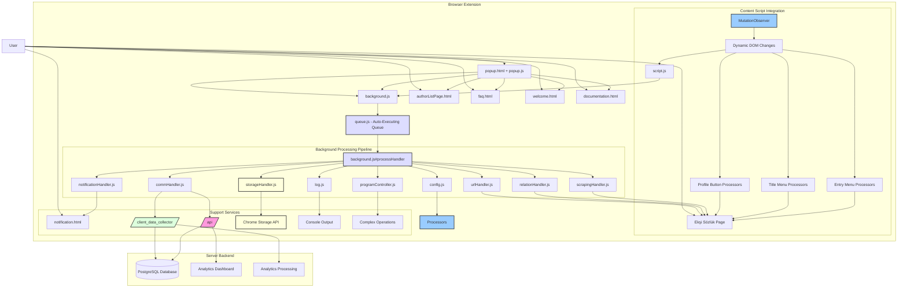

# EksiEngelPlus Project Overview

## Summary

The project "EksiEngelPlus" is a Chrome browser extension designed to facilitate mass blocking/unblocking of users on Ekşi Sözlük. It provides comprehensive blocking options including individual users, their titles, users who favorited specific entries, followers of specific users, and advanced migration features between blocked/muted states.

*   **Frontend (Chrome Extension - Manifest V3):**
    *   **Main UI Components:**
        *   **Popup Interface (`popup.html`/`popup.js`)** - Main extension configuration menu with settings for various blocking options
        *   **Notification Page (`notification.html`/`notification.js`)** - Dedicated status tracking page showing real-time progress, queue status, and operation results
        *   **Content Script (`script.js`)** - Injects blocking buttons and menus directly into Ekşi Sözlük pages using MutationObserver for dynamic content handling
        *   **Background Service Worker (`background.js`)** - Central orchestrator managing all blocking operations, queue processing, and coordination
    *   **Core Processing Modules:**
        *   **Queue Management (`queue.js`)** - Advanced auto-executing queue system with task prioritization and execution coordination
        *   **Program Controller (`programController.js`)** - High-level operation controller handling complex workflows like migration, bulk operations, and title management
        *   **Relation Handler (`relationHandler.js`)** - Direct communication with Ekşi Sözlük's blocking/unblocking API endpoints
        *   **Scraping Handler (`scrapingHandler.js`)** - Comprehensive web scraping for user data, followers, favorites, and page content
        *   **Notification Handler (`notificationHandler.js`)** - Real-time status updates and progress tracking to notification page
    *   **Support Services:**
        *   **Communication Handler (`commHandler.js`)** - Backend API communication for analytics and data collection
        *   **Configuration Manager (`config.js`)** - Persistent settings with 15+ configuration options for customization
        *   **Storage Handler (`storageHandler.js`)** - Chrome storage management for user lists, counts, and preferences
        *   **URL Handler (`urlHandler.js`)** - Site accessibility validation and URL management
        *   **Logging System (`log.js`)** - Comprehensive logging with levels and data persistence
        *   **Utilities (`utils.js`)** - Helper functions for data processing, timing, and validation
        *   **DOM Utilities (`jsdom.js`)** - DOM manipulation and element processing helpers
        *   **Enums (`enums.js`)** - Centralized constants for action types, modes, sources, and configuration values
    *   **Additional UI Pages:**
        *   **Author List Page (`authorListPage.html`/`authorListPage.js`)** - User list management interface
        *   **FAQ Page (`faq.html`/`faq.js`)** - Help and documentation interface
        *   **Welcome Page (`welcome.html`/`welcome.js`)** - Initial setup and onboarding interface
        *   **Documentation Page (`documentation.html`)** - Extended documentation and guides
    *   **Styling System:** Comprehensive CSS architecture with modular stylesheets for different UI components

*   **Backend (Django Server):**
    *   **Action API (`/api/`)** - Comprehensive analytics endpoint receiving detailed logs about *blocking/unblocking actions* performed by the extension (`/action/`). Aggregates data to provide statistics like most blocked users, total actions, success rates, failure analysis, and provides current Ekşi Sözlük URL status (`/where_is_eksisozluk/`).
    *   **Client Data Collector (`/client_data_collector/`)** - Receives general *client-side analytics* including UI interactions (`/analytics`), configuration data, and usage patterns (`/upload_v2`).
    *   **Database Integration** - PostgreSQL backend with Django ORM for data persistence and aggregation

## Key Features

* **Comprehensive User Blocking:**
  * Individual user blocking from entries, profiles, or lists
  * Mass blocking users who favorited specific entries
  * Mass blocking followers of specific users
  * Title-based blocking (block all titles by specific users)
* **Date-Based User Filtering:**
  * Filter users by account registration date before blocking
  * Protect legacy accounts (configurable, e.g., accounts older than 5 years)
  * Block newly created accounts (configurable threshold)
  * Custom filter rules with BLOCK, SKIP, or PROTECT actions
  * 30-day TTL caching for registration dates to optimize performance
  * Full tabbed UI for filter configuration in notification page
* **Advanced Migration System:**
  * Migrate blocked users to muted status (and vice versa)
  * Block all muted users in bulk
  * Block titles of blocked/muted users
  * Unblock all users and remove all mutes
* **Sophisticated Configuration:**
  * Enable/disable title blocking, mute functionality, analysis options
  * Premium icon hiding (green/yellow badges)
  * Protection of followed users from blocking
  * Date-based filtering with customizable rules
  * Analysis to avoid redundant actions
  * Configurable logging and data collection
* **Dynamic UI Integration:**
  * Injects buttons into entry menus, title menus, and profile pages
  * MutationObserver-based dynamic content detection
  * Real-time progress tracking and status updates
* **Analytics & Monitoring:**
  * Optional data collection for usage statistics
  * Comprehensive logging with different severity levels
  * Real-time operation monitoring and error tracking
* **Storage Management:**
  * Persistent storage of user lists and counts
  * Configuration persistence
  * Progress state management across sessions

## Architecture Diagram

## Technical Architecture

### Frontend Structure

**Core JavaScript Modules (20+ files):**
- `background.js` - Service worker orchestrator (970+ lines)
- `script.js` - Content script with MutationObserver (776+ lines)
- `programController.js` - Complex operation controller (846+ lines)
- `notificationHandler.js` - Real-time status management
- `queue.js` - Auto-executing task queue system
- `relationHandler.js` - Direct Ekşi Sözlük API communication
- `scrapingHandler.js` - Web scraping and data extraction
- `config.js` - Configuration management with 15+ options
- `commHandler.js` - Backend API communication
- `storageHandler.js` - Chrome storage abstraction
- `urlHandler.js` - Site accessibility validation
- `log.js` - Comprehensive logging system
- `utils.js` - Utility functions and helpers
- `jsdom.js` - DOM manipulation utilities
- `enums.js` - Centralized constants and enums

**UI Components (6 HTML pages + corresponding JS):**
- `popup.html/js` - Main configuration interface
- `notification.html/js` - Real-time progress tracking
- `authorListPage.html/js` - User list management
- `faq.html/js` - Help and documentation
- `welcome.html/js` - Onboarding interface
- `documentation.html` - Extended documentation

**Styling System (6 CSS files):**
- `customPopup.css` - Main popup styling
- `customNotification.css` - Notification page styling
- `buttons.css` - Button component styles
- `switchButtons.css` - Toggle switch components
- `footer.css` - Footer element styles
- `tooltip.css` - Tooltip component styles

### Backend Structure

**Django Applications:**
- `api/` - Main analytics API with detailed action logging
- `client_data_collector/` - Client-side analytics and usage data
- `where_is_eksisozluk/` - Ekşi Sözlük URL status monitoring
- `django_EksiEngel/` - Core Django project configuration

**API Endpoints:**
- `/api/action/` - Action logging and analytics
- `/api/where_is_eksisozluk/` - Site accessibility monitoring
- `/client_data_collector/analytics/` - UI interaction analytics
- `/client_data_collector/upload_v2/` - Configuration and usage data

### Configuration Options

The extension provides 15+ configurable options:
- **Core Features:** Title blocking, mute functionality, noob author handling
- **Analysis Options:** Pre-operation analysis, redundant action prevention, followed user protection
- **UI Customization:** Premium icon hiding, logging levels, console output
- **Data Collection:** Server communication, log sending, analytics participation
- **Site Configuration:** Custom Ekşi Sözlük URLs, server endpoints

### Advanced Features

**Migration System:**
- Blocked → Muted user migration with bulk processing
- Muted → Blocked user migration with title blocking
- Complete unblock/mute removal operations
- Progress tracking and error handling

**Queue Management:**
- Auto-executing task queue with priority handling
- Concurrent operation prevention
- Progress state persistence
- Early stop capability with cleanup

**Storage Management:**
- Persistent user lists (blocked/muted)
- Configuration persistence across sessions
- Progress state recovery
- Count management and updates

**Notification System:**
- Real-time progress updates
- Queue status monitoring
- Error handling and reporting
- Cooldown management for API limits

## Development Notes

- **Manifest Version:** 3 (latest Chrome extension standard)
- **Module System:** ES6+ modules with import/export
- **Async/Await:** Extensive use throughout for promise handling
- **Chrome APIs:** tabs, storage, notifications, runtime messaging
- **Database:** PostgreSQL with Django ORM
- **Backend:** Django 4.1 with Django REST Framework
- **No External Frameworks:** Vanilla JavaScript for DOM manipulation
- **Internationalization:** Turkish language interface with English code comments

This architecture provides a robust, scalable solution for mass user management on Ekşi Sözlük with comprehensive analytics, real-time monitoring, and extensive configuration options.