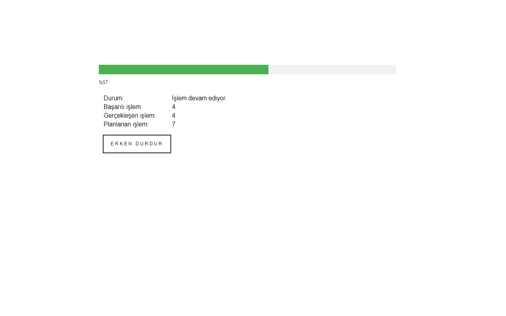

<h2> Ekşi Engel</h2>

Google Chrome extension that allows mass blocking of authors for the social media platform Ekşi Sözlük.

<h3>Briefly Features</h3>

- It can block everyone who favorited a specific post.

- It can block/unblock authors entered as a list.

- It can unblock all blocked authors.

Ekşi Sözlük has three different block types: the ban on an author, the ban on all pages that were created by an author, and the mute on an author. Ekşi Engel supports all types of blocks.

After the authors to be blocked/unblocked are received from the user, the blocking/unblocking process is performed respectively for the accounts in the list.

Operations take place in a newly opened tab, while the user can navigate freely in other tabs. Finally, the newly opened tab closes by itself when the process is finished.

In addition, the user is informed about how many authors have been successfully blocked.

<h3>My Motivation</h3>

I've been seeing some users make and share block lists for a long time. I thought we could easily do this with an extension.

It should be added that I developed Ekşi Engel voluntarily, so it does not contain any advertisements or has any other commercial purpose.

<h3>Server?</h3>

As long as it is allowed in the settings menu, log data and list of blocked users are sent to Ekşi Engel servers.

This data is planned to be used later to obtain the information of the most blocked authors and to block these authors via the extension.

<h3>Links and Images</h3>

Ekşi Engel in Chrome Webstore: [link](https://chrome.google.com/webstore/detail/ek%C5%9Fi-engel/cpfbfacaggnedffhdgdgmhkobijckkha)

Version notes: [link](https://h-enes-simsek.github.io/EksiEngel/versionnotes.html)  

