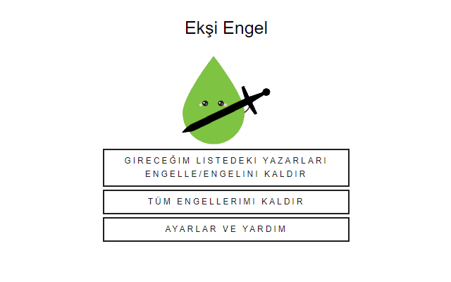
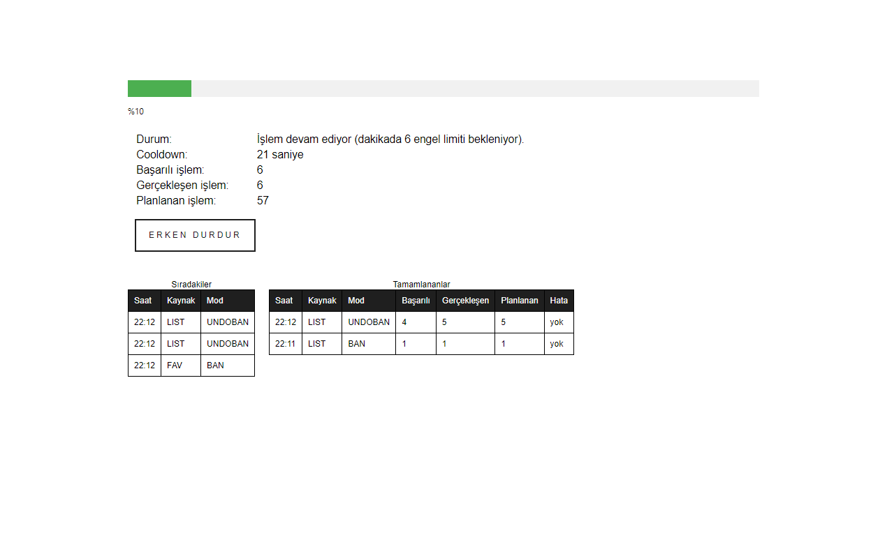

<h2> Ekşi Engel</h2>

Google Chrome extension that allows mass blocking of authors for the social media platform Ekşi Sözlük.

<h3>Briefly Features</h3>

Ekşi Engel can perform the following actions.

- To block everyone who favorited a specific post

- To block everyone who follows a specific author

- To block/unblock authors entered as a list

- To unblock all blocked authors

Ekşi Sözlük has three different block types, and Ekşi Engel supports them all. 

- The ban on an author

- The ban on all pages that were created by an author
 
- The mute on an author

After the authors to be blocked/unblocked are received from the user, the blocking/unblocking process is performed respectively for the accounts in the list.

Operations take place in a newly opened tab, while the user can navigate freely in other tabs. In addition, the user is informed about the ongoing process and how many authors have been successfully blocked.

Ekşi Sözlük put a limit on the blocking speed in January 2023. Different types of blocks might have different limits, but usually the limit is 6 operations per minute. To overcome this problem, Ekşi Engel performs the maximum number of allowed operations per minute and waits during cooldown period. Furthermore, users do not have to wait to start a new blocking operation during another is running. A queue holds the incoming requests made by the user.

<h3>Server Part</h3>

As long as it is allowed in the settings menu, log data and list of blocked users are sent to Ekşi Engel servers.

This data is planned to be used later to obtain the information of the most blocked authors and to block these authors via the extension.

<h3>Links and Images</h3>

Ekşi Engel in Chrome Webstore: [link](https://chrome.google.com/webstore/detail/ek%C5%9Fi-engel/cpfbfacaggnedffhdgdgmhkobijckkha)

Version notes: [link](https://h-enes-simsek.github.io/EksiEngel/releaseNotes.html)  

 

