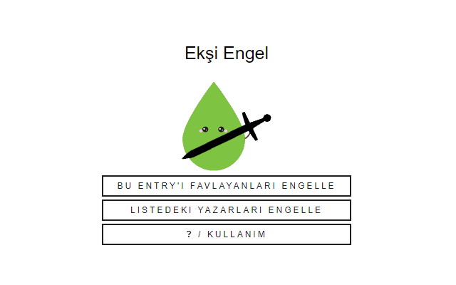

<h2> Ekşi Engel</h2>

Ekşisözlük'te toplu olarak engelle/başlıklarını engelle işlemi yapılmasına yardımcı olan Google Chrome eklentisi.

<h3>Nasıl Çalışıyor?</h3>
İki şekilde:

- Bir entry'i favorileyen herkes engellenebiliyor.

- Bir liste halinde girilen yazarlar engellenebiliyor.

Kullanıcıdan engellenecek yazarlar alındıktan sonra (entry'i favlayanlar scrap ediliyor ya da manuel olarak elle bir liste giriliyor) listedeki hesaplar sırasıyla ziyaret edilerek engelleniyor. 

İşlemler yeni açılan bir tab içinde gerçekleşiyor, engelleme devam ederken başka tablarda gezinilebiliyor ve sonunda engel için açılan tab kendiliğinden kapanıyor. 

Ayrıca kullanıcıya kaç yazarın başarıyla engellendiği de bir uyarı ile aktarılıyor.

<h3>Neden Böyle Bir Uygulama Geliştirdin?</h3>

Uzun zamandır bazı yazarların liste yapıp paylaştığını görüyordum. Bu işi kolayca eklenti ile yapabiliriz diye düşündüm.

Şunu da eklemekte fayda var ki Ekşi Engel'i gönüllü olarak geliştirdim bundan dolayı herhangi bir reklam içermiyor, bilgilerinizi toplamıyor ya da başka ticari bir amacı bulunmuyor.

<h3>Linkler ve Görseller</h3>

Ekşi Engel chrome webstore [linki](https://chrome.google.com/webstore/detail/ek%C5%9Fi-engel/cpfbfacaggnedffhdgdgmhkobijckkha)

Versiyon notları [linki](https://h-enes-simsek.github.io/EksiEngel/versionnotes.html)  

