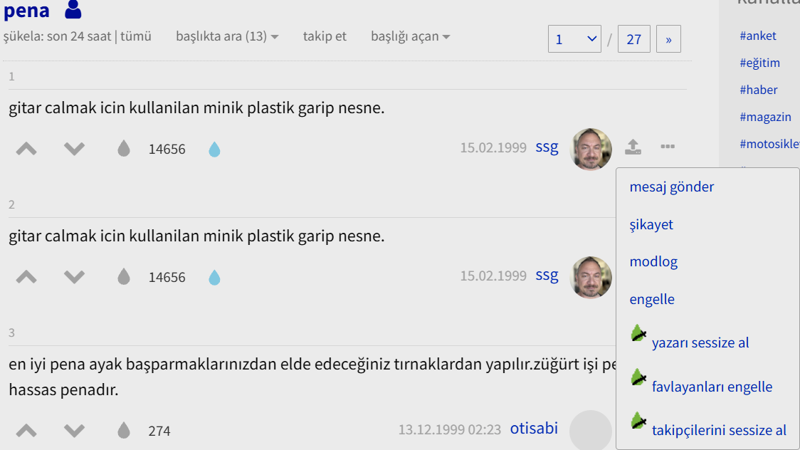
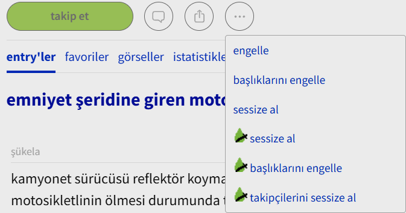
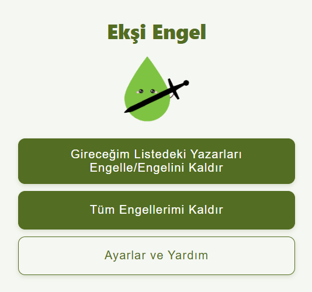
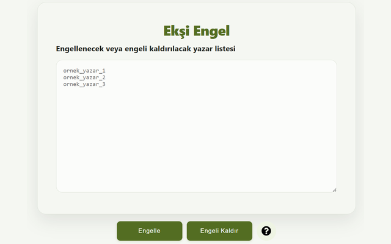
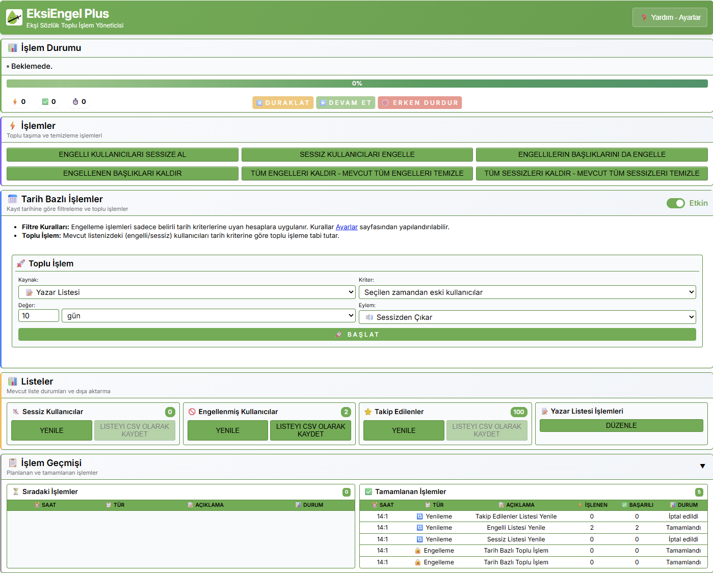

<h2> Ekşi Engel Plus</h2>

Google Chrome extension that allows mass blocking of authors for the social media platform Ekşi Sözlük.

<h3>Features</h3>

Ekşi Engel Plus can perform the following actions:

- Block everyone who favorited a specific post
- Block everyone who follows a specific author
- Block everyone who posted on a specific topic
- Block/unblock authors entered as a list
- Unblock all blocked authors

<h3>Date-Based User Filtering</h3>

Filter users by their account registration date before blocking. This helps protect legacy accounts or block newly created accounts.

- **Default Filter:** Block accounts **NEWER_THAN 3650 days** (10 years)
- Filter criteria: NEWER_THAN, OLDER_THAN, BEFORE_DATE, AFTER_DATE
- Automatic registration date caching with 30-day TTL for performance
- Configurable per-operation or via global filter rules

<h3>Date-Based Bulk Actions</h3>

Perform bulk operations on your blocked/muted users based on account age:

- **Default Configuration:** OLDER_THAN 3650 days → Unmute users
- Source options: Blocked users list, Muted users list, or custom author list
- Actions: Block, Mute, Unblock, Unmute, Follow, or Unblock+Follow, Mute+Follow

<h3>Advanced Migration System</h3>

Easily migrate between blocked and muted status in bulk:

- Migrate blocked users to muted status
- Migrate muted users to blocked status
- Block all muted users in bulk
- Block titles of blocked/muted users
- Unblock all users and remove all mutes

<h3>Operation Controls</h3>

- **Pause/Resume:** Checkpoint-based pause and resume for long operations
- **Queue System:** Queue multiple operations that execute automatically
- **Real-time Progress:** Live progress tracking with success/failure counts

<h3>Ekşi Sözlük Block Types</h3>

Ekşi Sözlük has three different block types, and Ekşi Engel Plus supports them all:

- **Engelle (Ban):** Block an author
- **Başlık Engelle (Title Ban):** Block all pages created by an author
- **Sessize Al (Mute):** Mute an author

<h3>Dynamic UI Labels</h3>

The extension dynamically changes menu labels based on your configuration:

- When **Mute enabled** (default): Shows "sessize al" / "sessizden çıkar"
- When **Mute disabled**: Shows "engelle" / "engellemeyi bırak"
- Menu options adapt: "Engelli kullanıcıları sessize al" vs "Engelli kullanıcıları engelle"

<h3>Default Configuration</h3>

| Setting | Default | Description |
|---------|---------|-------------|
| enableMute | true | Mute instead of block by default |
| enableDateFilter | false | Date-based filtering disabled by default |
| dateFilterRules | Block NEWER_THAN 3650 days | Default filter rule |
| sendData | true | Analytics enabled |
| enableProtectFollowedUsers | true | Don't block followed users |
| enableTitleBan | false | Title blocking disabled |

<h3>Rate Limiting</h3>

Ekşi Sözlük limits blocking speed (usually 6 operations per minute). Ekşi Engel Plus automatically performs the maximum allowed operations per minute and waits during cooldown periods. Multiple operations are queued and executed sequentially.

<h3>Server Part</h3>

As long as it is allowed in the settings menu, log data and list of blocked users are sent to Ekşi Engel Plus servers. This data is used to obtain statistics on the most blocked authors.

<h3>Links</h3>

Ekşi Engel Plus in Chrome Webstore: [link (WIP)](https://chrome.google.com/webstore/detail/ek%C5%9Fi-engel-plus/)

Version notes: Extension içindeki versiyon notlarına bakın  

 

